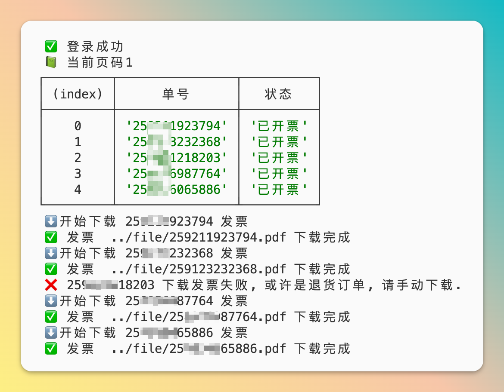

<h1>京东发票自动下载</h1>

## 使用方法

### 项目下载
`git clone git@github.com:mydaoyuan/jd-invoice.git` 下载项目代码. 

`cd jd-invoice && npm i` 进入目录, 安装依赖.

### 启动项目

如果需要进行换开发票, 请修改 `config.js` 配置, 填入换开的公司名称和税号.

`npm run start` 进行自动化下载.

第一次使用需要进行扫码登录.

Mac 下会自动打开登录图片, 如果不能自动打开, 请在命令执行后, 手动打开目录下的 login.png, 使用京东APP 扫码登录. 后续会将 `cookie` 保存在**本地使用**.

## Tips

### 下载 puppeteer 失败

执行 `PUPPETEER_DOWNLOAD_HOST=https://storage.googleapis.com.cnpmjs.org npm install puppeteer
` 可切换 cnpm 源下载.
